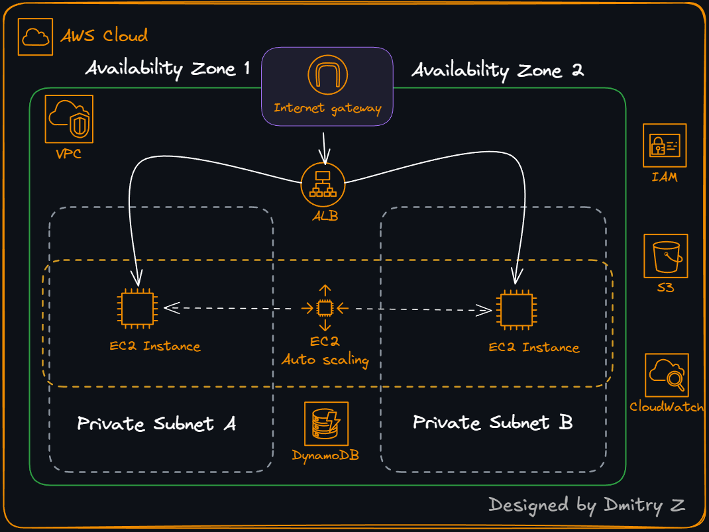

# AWS Employee Directory App

## Overview

The AWS Employee Directory App is designed to showcase the use of various AWS services. It allows users to manage employee data, including adding, updating, and deleting records. The app leverages AWS services such as Amazon EC2, Amazon S3, Amazon DynamoDB, and AWS IAM to provide a scalable and secure solution.

## Features

- **Employee Management**: Add, update, and delete employee records.
- **Scalability**: Utilizes Amazon EC2 for scalable compute resources.
- **Storage**: Stores employee data in Amazon DynamoDB.
- **Security**: Implements AWS IAM for secure access control.
- **File Storage**: Uses Amazon S3 for storing employee-related files.

## Architecture

The application is built using a multi-tier architecture:

1. **Frontend**: A web interface for interacting with the employee directory.
2. **Backend**: A RESTful API built with AWS services to handle business logic and data processing.
3. **Database**: Amazon DynamoDB for storing employee data.
4. **File Storage**: Amazon S3 for storing files such as employee photos.

## Prerequisites

- AWS Account
- AWS CLI configured
- Terraform installed

## Setup Instructions

1. **Deploy the infrastructure**:

   - Use the Terraform scripts provided in this repo: [aws-emp-app-tf](https://github.com/DimitryZH/aws-emp-app-tf) to set up the necessary AWS resources.

2. **Configure the application**:
   - Update the configuration files with your AWS resource details.

## Usage

**Access the web interface via the provided URL of the Load Balancer.**

**Use the web interface to manage employee records.**

**Use the /info tab in the web address bar to get information about instances and to use the stress CPU feature. Click "stress cpu 10 min" to trigger the thresholds and enable scaling up the app from 2 to 4 EC2 instances in each AZ.**

## Conclusion

The AWS Employee Directory App demonstrates the power and flexibility of AWS services in building scalable and secure applications. By leveraging services like Amazon EC2, Amazon S3, Amazon DynamoDB, and AWS IAM, the app provides a robust solution for managing employee data. Follow the setup instructions to deploy the app and explore its features to understand how AWS can be utilized for similar projects.
