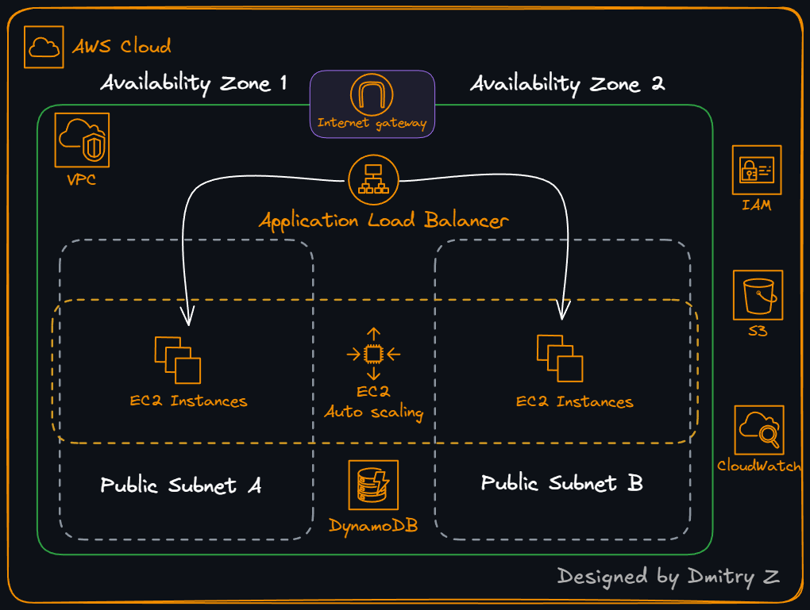

# AWS EC2 Deployment Guide

This document provides a step-by-step guide to deploy the Enterprise App on **Amazon Web Services (AWS)** using **EC2, an Application Load Balancer, Auto Scaling, DynamoDB, and S3**. The deployment is automated using **Terraform** and a cloud-init style **user data script**.

This AWS environment represents the **legacy / baseline deployment** for the migration story in this repository. The same Enterprise App is later re-platformed onto more modern architectures on Google Cloud (see [`GCP/deployment_gce.md`](../GCP/deployment_gce.md) and [`GCP-Cloud-Run/deployment_cloud_run.md`](../GCP-Cloud-Run/deployment_cloud_run.md)).

---

## Prerequisites

Before starting, ensure you have:

- An **AWS account** with permissions to create EC2, VPC, IAM, DynamoDB, S3, and Load Balancer resources
- **AWS CLI** installed and configured
- **Terraform** installed (v1.3+ recommended)
- Basic familiarity with AWS regions and IAM

This guide assumes you are working from the repository root and that the AWS baseline code resides in this [`AWS`](.) folder.

---

## Step 1 – Configure AWS Credentials

On your workstation, configure AWS credentials for the account and region where you want to deploy the baseline environment.

You can use `aws configure`:

```bash
aws configure
```

Provide at minimum:

- **AWS Access Key ID**
- **AWS Secret Access Key**
- **Default region name** (for example, `ap-east-1`)

Terraform reads credentials from the same locations as the AWS CLI (shared credentials file, environment variables, or IAM role if running in AWS).

---

## Step 2 – Review the Architecture (AWS Baseline)

The AWS deployment is a classic multi-tier web application:

- **Frontend / Web Tier**: Flask web app running on EC2 instances behind an **Application Load Balancer**
- **Application Tier**: Python/Flask code under [`AWS/app`](app/application.py)
- **Data Tier**:
  - **Amazon DynamoDB** table for employee records
  - **Amazon S3** bucket for employee photos
- **Networking & Security**:
  - VPC with **public subnets** for EC2 instances
  - **Security groups** for EC2 and the load balancer
  - **IAM roles** attached directly to instances for access to DynamoDB and S3

Terraform definitions for this baseline live under [`AWS/terraform`](terraform/main.tf) and include EC2, VPC, IAM, DynamoDB, S3, and load balancing resources.

Architecture diagram for the baseline AWS deployment:



---

## Step 3 – Inspect the Terraform Configuration (Optional)

The key Terraform files for the AWS deployment are:

- Provider and core configuration: [`AWS/terraform/main.tf`](terraform/main.tf)
- Global variables and outputs: [`AWS/terraform/vars.tf`](terraform/vars.tf)
- EC2, Auto Scaling, and Load Balancer: [`AWS/terraform/ec2.tf`](terraform/ec2.tf)
- S3 bucket and policy: [`AWS/terraform/s3.tf`](terraform/s3.tf)
- IAM roles and policies: [`AWS/terraform/iam.tf`](terraform/iam.tf)
- DynamoDB table: [`AWS/terraform/dynamodb.tf`](terraform/dynamodb.tf)
- VPC, subnets, and networking: [`AWS/terraform/vpc.tf`](terraform/vpc.tf)

You do not need to modify these files to complete a basic deployment, but you may wish to review them to understand the legacy design and how it differs from the hardened GCP architectures.

---

## Step 4 – Configure Terraform Variables

Default variables for the AWS deployment are defined in [`AWS/terraform/vars.tf`](terraform/vars.tf). The key values are:

- `region` – AWS region for all resources (default: `ap-east-1`)
- `instance_type` – EC2 instance type for the web tier (default: `t3.micro`)

For a simple deployment using defaults, you can proceed without changes. To customize, you can either:

1. Edit the defaults in [`AWS/terraform/vars.tf`](terraform/vars.tf), **or**
2. Create a `terraform.tfvars` file in [`AWS/terraform`](terraform/main.tf) with values like:

```hcl
region        = "us-east-1"
instance_type = "t3.small"
```

Terraform will automatically load `terraform.tfvars` when present.

---

## Step 5 – Initialize Terraform (AWS Stack)

From the repository root, switch to the AWS Terraform directory and initialize the workspace:

```bash
cd AWS/terraform

terraform init
```

Initialization will:

- Download the AWS and Random providers
- Prepare the local directory for `terraform plan` and `terraform apply`

---

## Step 6 – Deploy AWS Infrastructure

Review the proposed changes:

```bash
terraform plan
```

If the plan looks correct, apply it to create the baseline environment:

```bash
terraform apply
```

Confirm with `yes` when prompted.

Terraform will provision, in the selected AWS region:

1. **VPC and Subnets**
   - VPC for the Enterprise App
   - Public subnets in at least two Availability Zones for EC2 instances

2. **Security Groups**
   - Security group for the Application Load Balancer (HTTP ingress)
   - Security group for EC2 instances (allowing traffic from the load balancer)

3. **S3 Bucket for Photos**
   - S3 bucket for employee photos, defined in [`AWS/terraform/s3.tf`](terraform/s3.tf)
   - Bucket policy granting the application IAM role permissions on the bucket

4. **DynamoDB Table**
   - DynamoDB table for storing employee records, defined in [`AWS/terraform/dynamodb.tf`](terraform/dynamodb.tf)

5. **IAM Roles and Instance Profile**
   - IAM role for EC2 instances with permissions to access DynamoDB and S3, defined in [`AWS/terraform/iam.tf`](terraform/iam.tf)
   - Instance profile attached to the EC2 launch template

6. **EC2 Launch Template and Auto Scaling Group**
   - Launch template defined in [`AWS/terraform/ec2.tf`](terraform/ec2.tf)
   - User data script that:
     - Downloads the application package (`FlaskApp.zip`) from S3
     - Installs Python and dependencies
     - Installs the `stress` tool for load generation
     - Sets application environment variables:

       ```bash
       export PHOTOS_BUCKET=<S3 bucket name>
       export AWS_DEFAULT_REGION=<region>
       export DYNAMO_MODE=on
       ```

     - Starts the Flask app bound to port 80

   - Auto Scaling Group (ASG) across two subnets, with minimum and maximum capacity (e.g., 2–4 instances)
   - Scaling policy that targets average CPU utilization (see `aws_autoscaling_policy` in [`AWS/terraform/ec2.tf`](terraform/ec2.tf))

7. **Application Load Balancer (ALB)**
   - ALB defined in [`AWS/terraform/ec2.tf`](terraform/ec2.tf)
   - Target group and listener on port 80
   - Health checks for instances in the Auto Scaling Group

When `terraform apply` completes, Terraform outputs the public endpoint of the Application Load Balancer via the `employee-web-app-endpoint` output in [`AWS/terraform/vars.tf`](terraform/vars.tf).

---

## Step 7 – Verify Deployment

After Terraform finishes, locate the **load balancer DNS name**:

```bash
terraform output employee-web-app-endpoint
```

Example output:

```bash
employee-web-app-endpoint = "employee-web-app-lb-1234567890.ap-east-1.elb.amazonaws.com"
```

Open the Enterprise App in your browser:

```text
http://<employee-web-app-endpoint>
```

You should see the Enterprise App UI for the employee management application.

---

## Step 8 – Validate Application Functionality

Use the web interface exposed via the load balancer to validate core features:

- View the list of employees
- Add a new employee record
- Upload an employee photo (stored in the S3 bucket provisioned by Terraform)
- Edit and delete existing employee records

Example UI views from the baseline AWS deployment:


The application code, templates, and utility functions are located under [`AWS/app`](app/application.py), including:

- Flask entrypoint: [`AWS/app/application.py`](app/application.py)
- Configuration: [`AWS/app/config.py`](app/config.py)
- DynamoDB data access layer: [`AWS/app/database_dynamo.py`](app/database_dynamo.py)
- HTML templates: [`AWS/app/templates`](app/templates/main.html)

---

## Step 9 – Validate Auto Scaling Behavior

The AWS baseline uses an Auto Scaling Group with a CPU-based scaling policy (see `aws_autoscaling_policy` in [`AWS/terraform/ec2.tf`](terraform/ec2.tf)). To observe scaling in action:

1. Open the Enterprise App in your browser via the load balancer URL.
2. Navigate to the **`/info`** tab in the UI.
3. Trigger the CPU stress feature (for example, **"stress cpu 10 min"**), which runs the `stress` tool on the instance.
4. In the AWS Console, watch the **Auto Scaling Group** and **EC2 Instances** pages to see the group scale out (e.g., from 2 to 4 instances) and then scale back in when load subsides.

This behavior demonstrates how the legacy AWS deployment handles load using horizontal scaling at the instance level.

---

## Step 10 – Cleanup

When you no longer need the AWS baseline environment, destroy all resources managed by Terraform to avoid ongoing costs:

```bash
cd AWS/terraform

terraform destroy
```

Review the plan carefully and confirm with `yes`. Terraform will remove:

- EC2 instances, launch template, and Auto Scaling Group
- Application Load Balancer, target group, and listener
- DynamoDB table
- S3 bucket for photos (including objects, because `force_destroy = true` is set in [`AWS/terraform/s3.tf`](terraform/s3.tf))
- IAM roles and instance profile used by the application
- VPC, subnets, and security groups

If you created any additional resources outside of Terraform (for example, manual changes in the AWS Console), you must clean those up separately.

---

## Deployment Summary

By following this guide, you have deployed the **Enterprise App** on AWS with:

- A Flask web application running on **EC2 instances**
- An **Application Load Balancer** distributing HTTP traffic
- An **Auto Scaling Group** providing high availability and horizontal scaling
- **DynamoDB** as the primary data store for employee records
- An **S3 bucket** for storing employee photos
- **IAM roles and policies** granting the app access to DynamoDB and S3
- Infrastructure fully defined as code under [`AWS/terraform`](terraform/main.tf)

This environment serves as the **legacy baseline** for the migration journey documented in this repository. Subsequent guides ([`GCP/deployment_gce.md`](../GCP/deployment_gce.md) and [`GCP-Cloud-Run/deployment_cloud_run.md`](../GCP-Cloud-Run/deployment_cloud_run.md)) show how the same Enterprise App is re-platformed to more secure and modern architectures on Google Cloud while preserving its core functionality.

