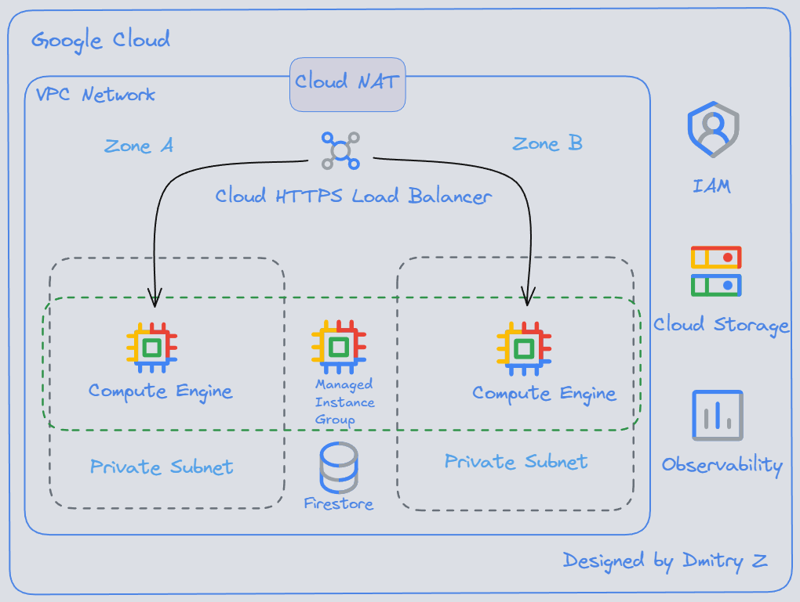

# GCP Compute Engine Deployment Guide

This document provides a step-by-step guide to deploy the Enterprise App on **Google Cloud Platform using Compute Engine and Managed Instance Groups**. The deployment is fully automated using **Terraform** and a startup script.

Architecture diagram for the GCP Compute Engine deployment:



---

## Prerequisites

Before starting, ensure you have:

- A Google Cloud Project with **Billing enabled**
- **Google Cloud SDK (gcloud)** installed
- **Terraform** installed (v1.5+ recommended)
- Basic permissions to create compute, network, and IAM resources

---

## Step 1 – Authenticate with GCP

Initialize gcloud and authenticate:

```bash
gcloud init
gcloud auth application-default login
```

Set your active project:

```bash
gcloud config set project <YOUR_PROJECT_ID>
```

---

## Step 2 – Enable Required APIs

```bash
gcloud services enable \
  compute.googleapis.com \
  iam.googleapis.com \
  cloudresourcemanager.googleapis.com \
  firestore.googleapis.com \
  storage.googleapis.com \
  cloudbuild.googleapis.com
```

---

## Step 3 – Prepare the Application Package

The Compute Engine instances retrieve the application code from a Cloud Storage bucket during startup.

From the GCP-Compute-Engine/app directory:

```bash
zip -r FlaskApp.zip .
```

Upload the archive to your Cloud Storage bucket:

```bash
gsutil cp FlaskApp.zip gs://<YOUR_BUCKET_NAME>/
```

---

## Step 4 – Configure Terraform Variables

Inside `GCP-Compute-Engine/terraform/`, create a `terraform.tfvars` file:

```hcl
project_id   = "your-gcp-project-id"
region       = "us-central1"
network_name = "employee-web-vpc"
subnet_name  = "employee-web-subnet"
bucket_name  = "your-gcs-bucket-name"
```

---

## Step 5 – Initialize Terraform

```bash
cd GCP-Compute-Engine/terraform
terraform init
```

---

## Step 6 – Deploy Infrastructure

Review the execution plan:

```bash
terraform plan
```

Apply the deployment:

```bash
terraform apply
```

Terraform will provision:

- VPC and private subnet
- Cloud NAT
- Firewall rules
- Service Account and IAM roles
- Instance Template with startup script
- Managed Instance Group
- Autoscaler
- HTTP Load Balancer
- Firestore (Datastore mode)
- Cloud Storage bucket

---

## Step 7 – Verify Deployment

After Terraform completes, it outputs the Load Balancer IP:

```bash
load_balancer_ip = "34.xxx.xxx.xxx"
```

Open the application in your browser:

```
http://<load_balancer_ip>
```

You should see the Enterprise App web interface.

---

## Step 8 – Validate Application Functionality

- View employee list
- Add a new employee
- Upload an employee photo
- Confirm data is stored in Firestore
- Confirm images appear from Cloud Storage

---

## Step 9 – Scaling & Self-Healing Validation

To verify auto-scaling:

- Generate CPU load on instances
- Observe new instances created in the Managed Instance Group
- Verify Load Balancer health checks

---

## Step 10 – Cleanup

To destroy all provisioned resources:

```bash
terraform destroy
```

---

## Deployment Summary

By following this guide, you have deployed:

- A fully load-balanced Flask web application
- Running on Compute Engine Managed Instance Group
- With private networking and Cloud NAT
- Backed by Firestore and Cloud Storage
- Provisioned entirely via Terraform

---

## Next Phase

The next modernization step will migrate this deployment to **Cloud Run**, demonstrating a fully serverless architecture:

```
/GCP-Cloud-Run/
```

---

## Author

**Dmitry Zhuravlev**  
Cloud & DevOps Engineer
