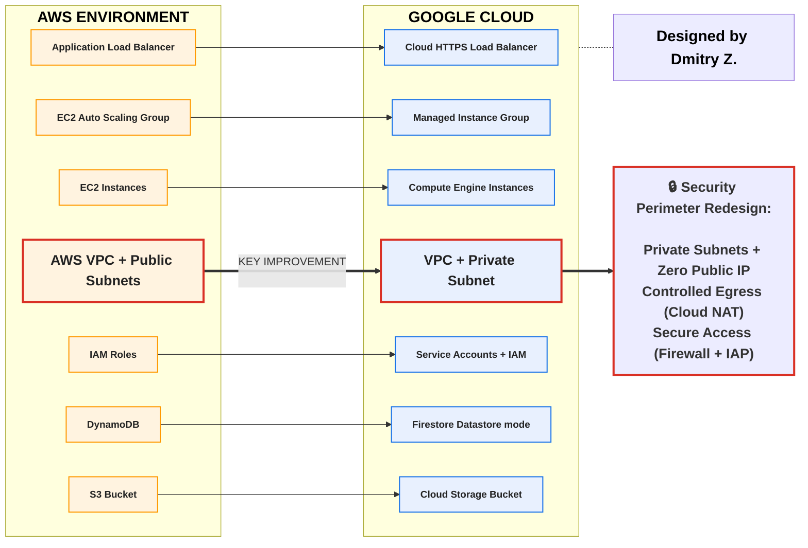

# AWS → GCP Migration Design

This document describes the architectural migration of the Employee Directory application from Amazon Web Services (AWS) to Google Cloud Platform (GCP). It focuses on service mapping, infrastructure redesign, and key technical decisions made during the re-platforming process.

---

## Migration Strategy

The migration follows a **Re-platform (Lift & Optimize)** approach:

- Core application logic remains unchanged (Python Flask)
- AWS-managed services are replaced with GCP-native equivalents
- Infrastructure is rebuilt using Terraform
- Security and networking are redesigned following GCP best practices

This approach allows rapid migration while improving scalability, maintainability, and security.

---

## Service Mapping (AWS → GCP)



---

## Architectural Evolution

### Original AWS Design

- EC2 Auto Scaling Group running Flask application
- Application Load Balancer distributing HTTP traffic
- DynamoDB for employee records
- S3 bucket for employee photos
- Public subnets with direct internet access
- IAM roles attached to EC2 instances

### Target GCP Design

- Managed Instance Group running Flask application on Compute Engine
- Global HTTP(S) Load Balancer
- Firestore (Datastore mode) for employee records
- Cloud Storage bucket for employee photos
- Private regional subnet with Cloud NAT for outbound access
- Service Accounts with fine-grained IAM permissions

---

## Key Design Decisions

### Networking
- AWS public subnets were replaced by **private subnets** in GCP
- **Cloud NAT** provides secure outbound internet access
- No public IPs assigned to application instances
- Load Balancer is the only public entry point

### Compute
- EC2 Auto Scaling Group replaced with **Managed Instance Group**
- Instance Template with startup script automates application bootstrapping
- Built-in health checks enable self-healing
- Autoscaler adjusts capacity based on CPU utilization

### Database
- DynamoDB replaced with **Firestore (Datastore mode)**
- NoSQL document model preserved
- Fully managed and serverless

### Object Storage
- S3 replaced with **Cloud Storage**
- Signed URLs used for secure image access

### Identity & Security
- IAM Roles replaced with **Service Accounts**
- Principle of Least Privilege enforced
- Secure SSH access via Identity-Aware Proxy (IAP)

---

## Migration Outcome

- Application successfully redeployed on GCP
- Full functional parity with AWS version
- Improved network security posture
- Automated infrastructure provisioning
- Scalable and self-healing compute layer

---

## Next Phase: Serverless Modernization

A second migration phase will introduce a **Cloud Run** deployment model:

```
/GCP-Cloud-Run/
```

This phase will demonstrate containerization, serverless scaling, and further cost optimization.

---

## Author

**Dmitry Zhuravlev**  
Cloud & DevOps Engineer

