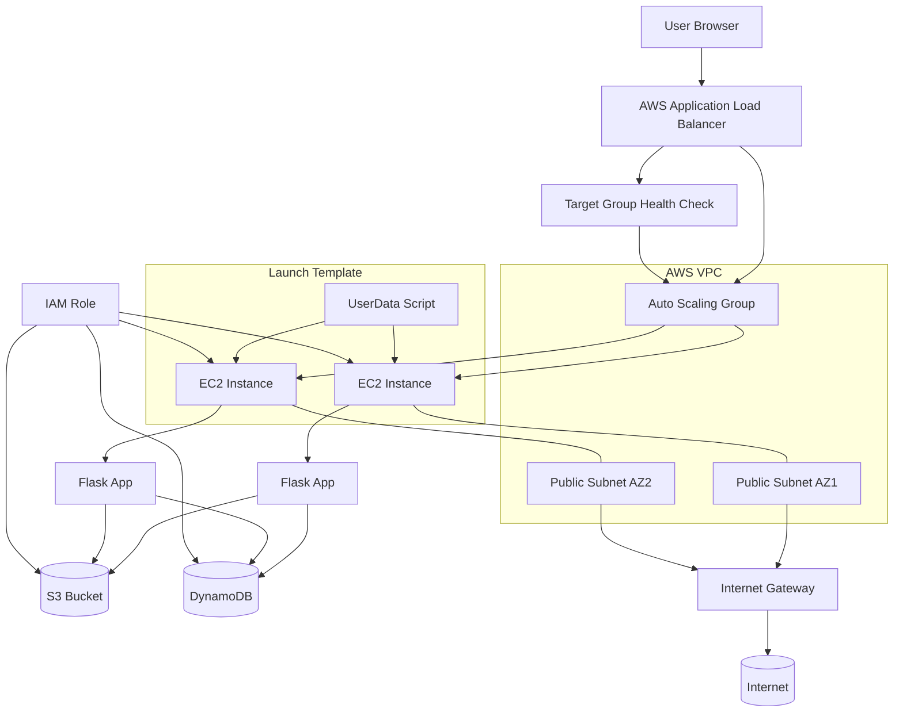
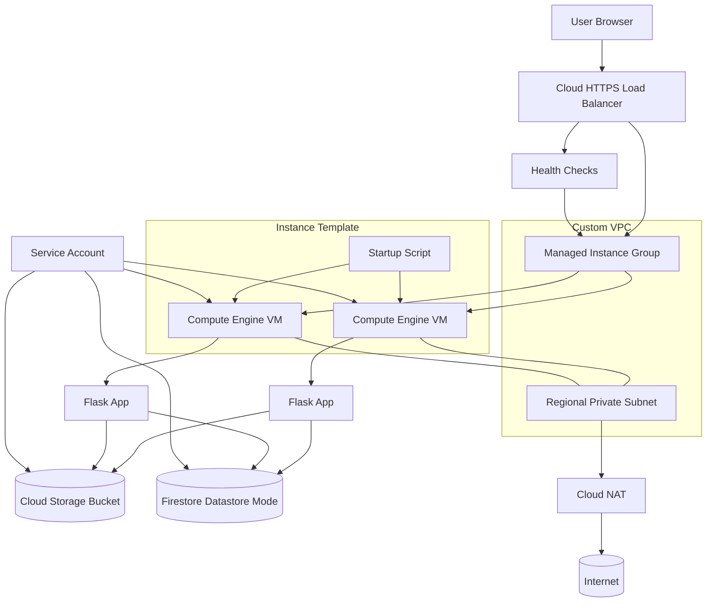

# Enterprise App Migration to Google Cloud (GCP)

This repository demonstrates a **real-world cloud migration project**, where a legacy 3-tier web application is deployed on AWS and then re-platformed to Google Cloud Platform using modern Infrastructure as Code and cloud-native services.

The project is designed both as:
- A **completed technical migration case study**
- A **reusable blueprint** for client cloud-migration projects

It showcases multi-cloud architecture, Terraform automation, scalable infrastructure, and application modernization.

---

## Project Goal

Migrate a production-style web application from AWS to GCP while:

- Preserving application functionality
- Replacing cloud-specific services with GCP equivalents
- Improving security and scalability
- Automating everything with Terraform
- Documenting the migration process end-to-end

---

## Repository Structure

```text
/
├── AWS/                      # Original AWS deployment (EC2 + ALB + DynamoDB + S3)
│   ├── README.md             # AWS Employee Directory app overview & usage
│   ├── app/                  # Application source code (Flask on AWS)
│   ├── assets/               # AWS architecture & app diagrams
│   └── terraform/            # AWS Infrastructure as Code
│       └── README.md         # AWS Terraform project documentation
│
├── GCP/                      # GCP migration using Compute Engine + MIG
│   ├── app/                  # Refactored Flask application for GCP
│   ├── assets/               # GCP diagrams
│   ├── terraform/            # GCP Infrastructure as Code
│   ├── migration.md          # AWS → GCP migration design & architecture
│   └── deployment_gce.md     # Step-by-step GCE deployment guide
│
├── FlaskApp.zip              # Packaged Flask app archive (used by some guides)
│
└── README.md                 # This file
```

> Note: A second phase of this project targets a **GCP Cloud Run** (serverless) migration. That implementation is referenced in the docs as `/GCP-Cloud-Run/` and is planned as a future extension of this repository.

---

## Documentation Overview

This repository includes several focused documentation files to guide you through both the AWS baseline and the GCP migration.

### AWS Documentation

- **AWS Application Overview & Usage**  
  See [AWS/README.md](AWS/README.md) for:
  - High-level description of the AWS Employee Directory App
  - Features and architecture of the original AWS deployment
  - Screenshots of the running application
  - Basic setup and usage instructions on AWS

- **AWS Terraform Infrastructure**  
  See [AWS/terraform/README.md](AWS/terraform/README.md) for:
  - Detailed description of the AWS Terraform project
  - Infrastructure components (VPC, EC2, ALB, Auto Scaling, DynamoDB, S3, IAM, etc.)
  - Steps to initialize, plan, apply, and destroy the AWS environment
  - Notes on security, modular structure, and cost optimization

### GCP (Compute Engine) Migration Documentation

- **AWS → GCP Migration Design**  
  See [GCP/migration.md](GCP/migration.md) for:
  - Overall migration strategy (**Re-platform / Lift & Optimize**)
  - Detailed AWS → GCP service mapping (ALB → HTTPS LB, EC2 → GCE, DynamoDB → Firestore, S3 → Cloud Storage, IAM Roles → Service Accounts, etc.)
  - Network and security redesign (private subnets, Cloud NAT, IAP)
  - Architectural comparison and key design decisions (compute, database, storage, identity)

- **GCP Compute Engine Deployment Guide**  
  See [GCP/deployment_gce.md](GCP/deployment_gce.md) for:
  - Prerequisites for deploying on GCP using Compute Engine + Managed Instance Groups
  - Commands to authenticate with GCP and enable required APIs
  - How to package and upload the Flask app and configure Terraform variables
  - Step-by-step Terraform workflow to provision the full GCP stack
  - Post-deployment validation, scaling tests, and cleanup

These documents together provide:

- A complete picture of the original AWS implementation
- A detailed design of the target GCP architecture
- Hands-on deployment instructions for reproducing the migration

---

## Architecture Comparison

### AWS – Original Deployment



---

### GCP – Compute Engine Migration



---

## Why This Project Matters

This repository demonstrates:

- **Terraform Infrastructure as Code**
- **Cloud networking & security design**
- **Scalable compute architectures**
- **Application refactoring for cloud services**
- **Real migration problem-solving**

The AWS and GCP documentation referenced above shows not only *what* was built, but *how* and *why* each design decision was made.

---

## Author

**Dmitry Zhuravlev**  
Cloud DevOps Engineer

---

## License

MIT License — free to reuse with attribution.
