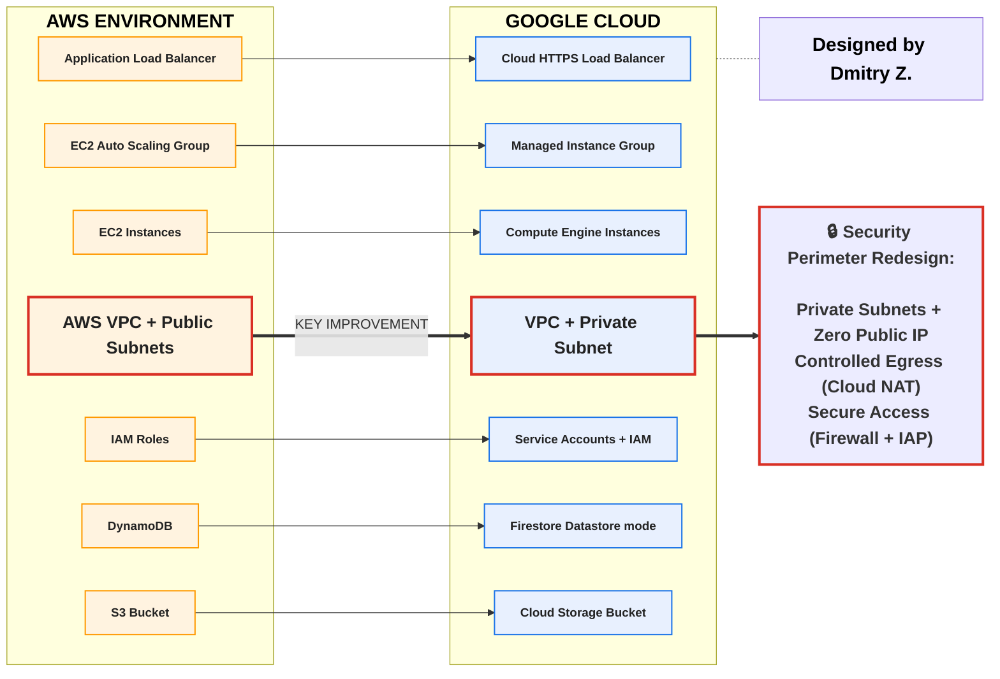
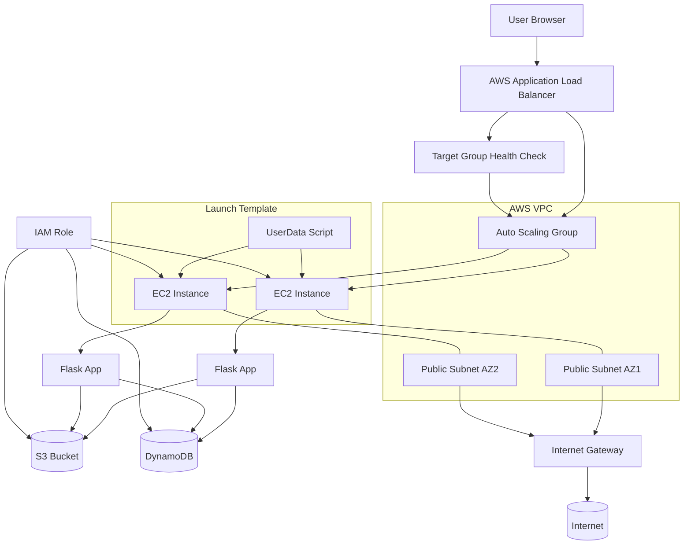
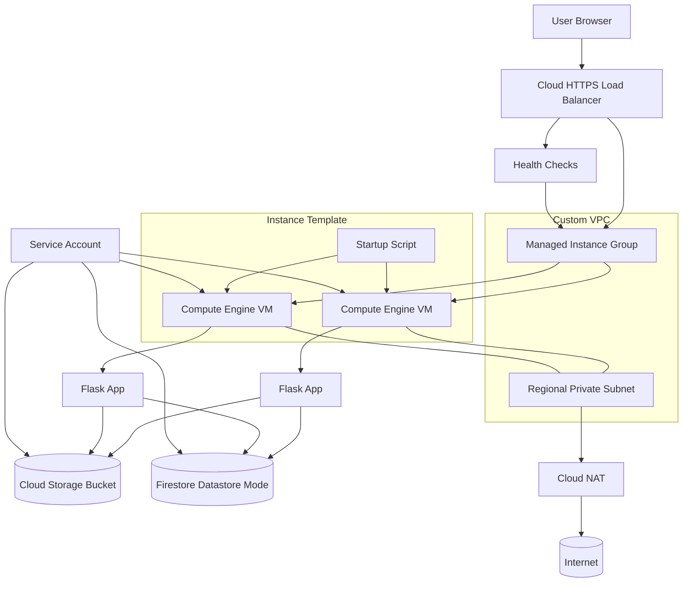
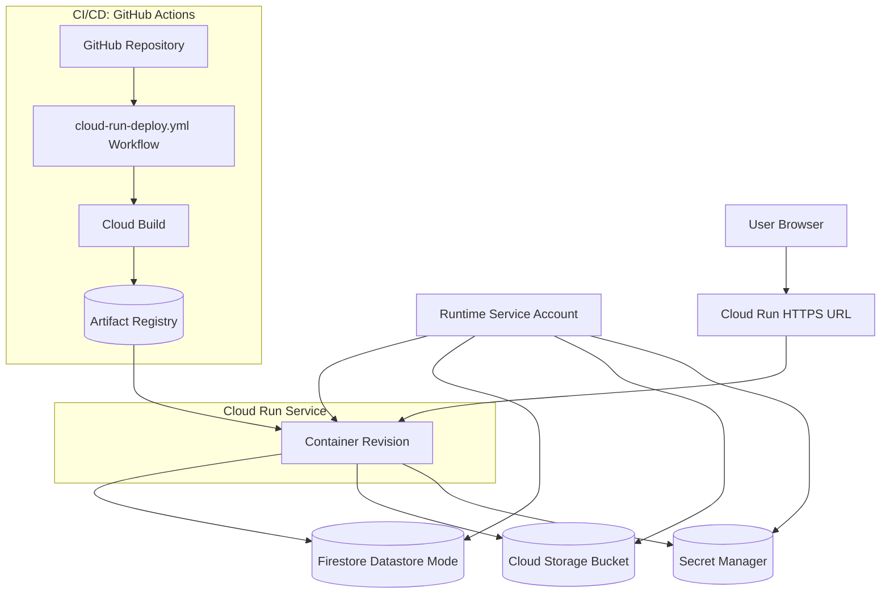

# Enterprise App Migration to Google Cloud (GCP)

This repository demonstrates a **real-world cloud migration project**, where a legacy 3‑tier web application is deployed on AWS and then re‑platformed to Google Cloud Platform using modern Infrastructure as Code and cloud‑native services.

The project is designed both as:

- A **completed technical migration case study**
- A **reusable blueprint** for client cloud‑migration projects

It showcases multi‑cloud architecture, Terraform automation, scalable infrastructure, application modernization, and CI/CD on Google Cloud.

---

## Project Goals

Migrate a production‑style web application from AWS to GCP while:

- Preserving application functionality
- Replacing cloud‑specific services with GCP equivalents
- Improving security, reliability, and scalability
- Automating everything with **Terraform** and **GitHub Actions**
- Documenting the migration process end‑to‑end, including both **Compute Engine** and **Cloud Run** options

---

## Repository Structure

```text
/
├── AWS/                          # Original AWS deployment (EC2 + ALB + DynamoDB + S3)
│   ├── app/                      # Flask application as originally deployed on AWS
│   ├── assets/                   # AWS architecture & UI screenshots
│   ├── terraform/                # AWS infrastructure as code (VPC, EC2, ALB, ASG, DynamoDB, S3, IAM)
│   └── deployment_aws.md         # AWS EC2 baseline deployment guide
│
├── GCP/                          # GCP migration using Compute Engine + MIG (Option 1)
│   ├── app/                      # Refactored Flask application for GCP services
│   ├── assets/                   # GCP diagrams (Compute Engine architecture)
│   ├── terraform/                # GCP infrastructure as code (VPC, MIG, LB, Firestore, Storage, IAM)
│   └── deployment_gce.md         # GCP Compute Engine deployment guide
│
├── GCP-Cloud-Run/                # GCP Cloud Run serverless deployment (Option 2)
│   ├── app/ (reuses ../GCP/app)  # Containerized Flask app (Dockerfile + requirements)
│   ├── assets/                   # Cloud Run workflow & access GIFs / screenshots
│   ├── terraform/                # Cloud Run Terraform stack (Artifact Registry, Cloud Run, IAM, buckets)
│   └── deployment_cloud_run.md   # GCP Cloud Run deployment guide
│
├── .github/
│   └── workflows/
│       └── cloud-run-deploy.yml  # CI/CD workflow for Cloud Run using Workload Identity Federation
│
├── FlaskApp.zip                  # Packaged Flask app archive (used in some AWS/GCP examples)
│
└── README.md                     # This file – consolidated migration overview & roadmap
```

> All platform‑specific deployment steps live in the `deployment_*.md` guides inside each solution folder.

---

## Deployment Options & Guides

This migration provides **three concrete deployments** of the same Enterprise App:

### 1. AWS Baseline – EC2 + ALB + DynamoDB + S3

- Legacy / baseline hosting of the Enterprise App on AWS.
- Technologies:
  - **Amazon EC2** Auto Scaling Group behind an **Application Load Balancer**
  - **DynamoDB** for employee records
  - **S3** for employee photos
  - **IAM roles** attached directly to EC2 instances
  - Public subnets with direct internet access
- Infrastructure defined in Terraform under `AWS/terraform/`.
- End‑to‑end deployment documented in [`AWS/deployment_aws.md`](AWS/deployment_aws.md).

This environment represents the **starting point** of the migration journey.

---

### 2. Option 1 – GCP Compute Engine + Managed Instance Group (MIG)

- Re‑platforming of the Enterprise App from AWS EC2 to **GCP Compute Engine**.
- Technologies:
  - **Managed Instance Group** of Compute Engine VMs
  - **Global HTTP(S) Load Balancer**
  - **Firestore (Datastore mode)** for employee records
  - **Cloud Storage** bucket for photos
  - **Custom VPC** with private subnet and **Cloud NAT**
  - **Service accounts** with least‑privilege IAM
- Infrastructure defined in Terraform under `GCP/terraform/`.
- Step‑by‑step deployment documented in [`GCP/deployment_gce.md`](GCP/deployment_gce.md).

This option demonstrates a "lift & optimize" path with improved security and networking while preserving a VM‑based architecture.

---

### 3. Option 2 – GCP Cloud Run (Serverless Containers)

- Further modernization of the Enterprise App to a **fully serverless container** model on Cloud Run.
- Technologies:
  - **Cloud Run** service running a containerized Flask app
  - **Artifact Registry** for Docker images
  - **Firestore (Datastore mode)** and **Cloud Storage** (same data model as Option 1)
  - Optional **Secret Manager** for sensitive configuration
  - **GitHub Actions** + **Workload Identity Federation** for CI/CD
- Infrastructure defined in Terraform under `GCP-Cloud-Run/terraform/`.
- End‑to‑end deployment and CI/CD wiring documented in [`GCP-Cloud-Run/deployment_cloud_run.md`](GCP-Cloud-Run/deployment_cloud_run.md).

This option removes most server management, delegating scaling and instance lifecycle to Cloud Run.

---

## AWS → GCP Migration Design (Option 1 – Compute Engine)

This section consolidates the migration design previously described in `GCP/migration.md`.

### Migration Strategy

The migration follows a **Re‑platform (Lift & Optimize)** approach:

- Core application logic remains unchanged (**Python Flask**)
- AWS‑managed services are replaced with **GCP‑native equivalents**
- Infrastructure is rebuilt using **Terraform**
- Security and networking are redesigned following **GCP best practices**

This approach allows rapid migration while improving scalability, maintainability, and security.

---

### Service Mapping (AWS → GCP)



---

### Architectural Evolution

**Original AWS Design**

- EC2 Auto Scaling Group running Flask application
- Application Load Balancer distributing HTTP traffic
- DynamoDB for employee records
- S3 bucket for employee photos
- Public subnets with direct internet access
- IAM roles attached to EC2 instances

**Target GCP Design (Compute Engine)**

- Managed Instance Group running Flask application on Compute Engine
- Global HTTP(S) Load Balancer
- Firestore (Datastore mode) for employee records
- Cloud Storage bucket for employee photos
- Private regional subnet with Cloud NAT for outbound access
- Service Accounts with fine‑grained IAM permissions

---

### Key Design Decisions

**Networking**

- AWS public subnets were replaced by **private subnets** in GCP
- **Cloud NAT** provides secure outbound internet access
- No public IPs assigned to application instances
- Load Balancer is the only public entry point

**Compute**

- EC2 Auto Scaling Group replaced with a **Managed Instance Group**
- Instance Template with startup script automates application bootstrapping
- Built‑in health checks enable self‑healing
- Autoscaler adjusts capacity based on CPU utilization

**Database**

- DynamoDB replaced with **Firestore (Datastore mode)**
- NoSQL document model preserved
- Fully managed and serverless

**Object Storage**

- S3 replaced with **Cloud Storage**
- Signed URLs (or equivalent) used for secure image access

**Identity & Security**

- IAM Roles replaced with **Service Accounts**
- Principle of Least Privilege enforced
- Secure SSH access via Identity‑Aware Proxy (IAP)

---

### Migration Outcome (Option 1)

- Application successfully redeployed on GCP Compute Engine
- Full functional parity with the AWS version
- Improved network security posture
- Automated infrastructure provisioning with Terraform
- Scalable and self‑healing compute layer via MIG + autoscaler

For hands‑on deployment instructions, follow [`GCP/deployment_gce.md`](GCP/deployment_gce.md).

---

## Architecture Diagrams (AWS vs GCP Compute Engine vs GCP  Cloud Run)

These diagrams visualize the baseline AWS deployment and the re‑platformed GCP Compute Engine design.

### AWS – Original Deployment



---

### GCP – Compute Engine Migration



---

### GCP – Cloud Run Serverless Architecture

The following diagram illustrates the **Cloud Run–based serverless option** and its data flow, including CI/CD, container image delivery, and runtime access to managed services.



---

## Option 2: Serverless Modernization with Cloud Run

This section consolidates the design and roadmap previously captured in `GCP-Cloud-Run/ROADMAP.md`.

### Context & Objectives

**Goal:** Provide a fully containerized, serverless deployment path on **Google Cloud Run** as an alternative to Compute Engine, while keeping:

- The same core application logic (Flask app under `GCP/app/`)
- The same data services (Firestore in Datastore mode, Cloud Storage for images)
- Infrastructure managed by **Terraform**
- Automated delivery via **GitHub Actions**

**Key deliverables:**

- Cloud Run solution folder: `GCP-Cloud-Run/`
- Containerized Flask app image stored in **Artifact Registry**
- Terraform stack to provision the Cloud Run service and supporting resources
- GitHub Actions workflow for build, test, image push, and deployment
- Documentation describing both Compute Engine and Cloud Run options

---

### Target Cloud Run Architecture

#### High‑Level Design

Main components:

- **Cloud Run service** `enterprise-app` hosting the Flask container
- **Artifact Registry** Docker repository for application images
- **Firestore (Datastore mode)** for employee records
- **Cloud Storage** bucket for employee photos
- **Secret Manager** for sensitive configuration (optional but recommended)
- (Optional) **Cloud HTTPS Load Balancer / Domain Mapping** for custom domains and TLS

Key properties:

- Region aligned with the existing GCE solution (for example `us-central1`)
- HTTP container listening on the `PORT` environment variable provided by Cloud Run
- Automatic scaling based on request load (concurrency and max instances)
- Per‑revision traffic management for safe rollouts and rollbacks

#### Networking & Security

- **Ingress**
  - Start with a public unauthenticated HTTPS endpoint for simplicity
  - Optionally restrict to internal / authenticated traffic later

- **Identity & Access Management**
  - Dedicated Cloud Run runtime service account, with access to:
    - Firestore (Datastore mode)
    - Cloud Storage bucket
    - Secret Manager

- **Configuration & Secrets**
  - Non‑sensitive configuration as environment variables
  - Sensitive values stored in Secret Manager, exposed to Cloud Run via env vars or mounted files

#### Scaling Parameters

- **Concurrency**: start with 20–40 requests per container
- **Min instances**: `0` (cost optimized) or `1` (reduced cold start)
- **Max instances**: sized according to expected traffic and Firestore/Storage quotas

---

### Containerization of the Flask Application

#### Dockerfile Design

Location: `GCP/app/Dockerfile`.

Baseline design:

- Base image: lightweight Python image (for example `python:3.11-slim`)
- Working directory: `/app`
- Copy `requirements.txt` from `GCP/app/requirements.txt` and install with `pip`
- Copy application code: `application.py`, `config.py`, `database_datastore.py`, `templates/`, etc.
- Configure Flask/Gunicorn to listen on `0.0.0.0:$PORT`
- Entrypoint: production WSGI server (for example **Gunicorn**) rather than `flask run`

Additional considerations:

- Implement a `/healthz` endpoint for liveness/readiness checks
- Ensure logging to stdout/stderr for Cloud Logging integration

#### Local Build & Test Flow

1. From the Dockerfile directory, build the image:
   - `docker build -t enterprise-app:test .`
2. Run locally:
   - `docker run -p 8080:8080 enterprise-app:test`
3. Validate core flows:
   - View employee list
   - Add employee
   - Upload and view employee photo

Outcome: a production‑ready container image that behaves correctly and is ready for Cloud Run.

---

### Terraform Stack for Cloud Run

#### Directory Structure

Dedicated Terraform stack for the Cloud Run option lives under:

- `GCP-Cloud-Run/terraform/main.tf`
- `GCP-Cloud-Run/terraform/variables.tf`
- `GCP-Cloud-Run/terraform/outputs.tf`
- Optional per‑environment `terraform.tfvars` or subdirectories

This stack focuses on Cloud Run–specific resources, complementing the existing `GCP/terraform/` stack used for Compute Engine.

#### Managed Resources

Planned / implemented Terraform resources include:

1. **Artifact Registry**
   - Docker repository for the application images (for example `enterprise-app-repo`).

2. **Service Account & IAM**
   - Cloud Run runtime service account with least‑privilege roles for:
     - Firestore (Datastore mode)
     - Cloud Storage
     - Secret Manager

3. **Cloud Run Service**
   - `google_cloud_run_service` with:
     - Image from Artifact Registry (tag provided by CI/CD)
     - Region, ingress, and scaling configuration
     - Environment variables (bucket name, datastore namespace, etc.)
     - (Optional) VPC connector if private egress is required

4. **Configuration & Secrets**
   - Secret Manager secrets for any sensitive configuration
   - Terraform bindings between Cloud Run service and secrets

5. **Networking / Domain (Optional)**
   - Domain mapping and/or HTTPS Load Balancer if a custom domain and Cloud Armor are desired

#### State & Environments

- Store Terraform state in a remote GCS bucket (consistent with existing practice)
- Use either:
  - **Workspaces** (`dev`, `stage`, `prod`), or
  - Directory‑per‑environment layout with environment‑specific `terraform.tfvars`

Outcome: `terraform apply` in `GCP-Cloud-Run/terraform/` provisions the complete Cloud Run–based stack.

---

### CI/CD with GitHub Actions

#### Objectives

Automate the full lifecycle for Cloud Run deployments:

1. Build and test the Flask application
2. Build and push the container image to Artifact Registry
3. Apply Terraform to update infrastructure and the Cloud Run service
4. Control promotion and approvals between dev/stage/prod

#### Authentication: GitHub → GCP

- Prefer **Workload Identity Federation (OIDC)** instead of static JSON keys
- Configure a Workload Identity Pool and Provider tied to the GitHub repository
- Grant the associated service account permissions to:
  - Push images to Artifact Registry
  - Run Terraform (create/update Cloud Run, IAM, secrets, etc.)

#### Workflow Structure

Workflow file: `.github/workflows/cloud-run-deploy.yml`.

Proposed jobs:

1. **build_and_push**
   - Trigger: push to `main`, `feature/*`, or tags
   - Steps:
     - Checkout code
     - Run tests for the Flask app
     - Authenticate to GCP via OIDC
     - Build Docker image with tag based on commit SHA or release tag
     - Push image to Artifact Registry

2. **terraform_plan** (for pull requests / non‑prod)
   - Initialize Terraform in `GCP-Cloud-Run/terraform/`
   - Run `terraform plan` using the new image tag as a variable
   - Publish plan summary as PR comment or artifact

3. **terraform_apply_and_deploy** (for main or release branches)
   - Protected by GitHub Environment (for example `prod`) with required reviewers
   - Runs `terraform apply` to update the Cloud Run service image and configuration
   - Optionally, post deployment details (URL, revision) back to the PR or release

#### Environment Promotion

Example mapping:

- `feature/*` branches → **dev** environment
- `main` branch → **stage** environment
- `release/*` branches or GitHub Releases → **prod** environment (with manual approval)

Outcome: repeatable, auditable Cloud Run deployments triggered from Git pushes.

---

### Environment Strategy (dev / stage / prod)

#### Project & Naming Options

Two primary patterns:

1. **Multi‑project isolation** (recommended for real‑world setups):
   - Separate GCP projects for `enterprise-dev`, `enterprise-stage`, and `enterprise-prod`

2. **Single‑project, prefixed resources** (simpler for demo/training):
   - One project with resource names prefixed by `dev-`, `stage-`, `prod-`

#### Terraform Parameters

Define variables for:

- `project_id`
- `region`
- `environment` (`dev`, `stage`, `prod`)
- Cloud Run service name and domain per environment
- Artifact Registry repo names (if different by environment)

#### CI/CD Integration

- Map GitHub Environments (`dev`, `stage`, `prod`) to Terraform variables and/or workspaces
- Store environment‑specific values as GitHub Environment secrets

Outcome: clear separation of concerns and minimized risk when deploying to production.

---

### Migration & Cutover from AWS to Cloud Run

#### Data Alignment

- Reuse the existing migration path from **DynamoDB → Firestore** and **S3 → GCS**
- Ensure Firestore and GCS in GCP are populated and validated before routing any production traffic to Cloud Run

#### Parallel Run Strategy

1. Deploy Cloud Run alongside the existing AWS and GCP Compute Engine environments
2. Expose Cloud Run via a separate URL (for example `gcp-cloudrun-preview.example.com`)
3. Run functional and performance tests against Cloud Run

#### Gradual Cutover

Depending on DNS and load balancer setup:

- Start with manual testing‑only traffic to Cloud Run
- Progress to gradual DNS weighting or traffic splitting via GCP Load Balancer (if used)
- Monitor:
  - Error rates (HTTP 5xx)
  - Latency percentiles
  - Resource utilization and cost

#### Rollback Plan

- Maintain the ability to:
  - Repoint DNS to AWS ALB or to the GCP Compute Engine MIG
  - Roll back to a previous Cloud Run revision (built‑in feature)
- Keep a registry of image tags and corresponding Terraform states / git SHAs

Outcome: controlled transition from AWS to GCP Cloud Run with a clearly defined rollback path.

---

### Milestones Summary

1. **Architecture & Design**
   - Define Cloud Run architecture, networking, IAM, and environment strategy

2. **Containerization**
   - Implement and validate Dockerfile and local container run for the Flask app

3. **Terraform Implementation**
   - Build `GCP-Cloud-Run/terraform/` to provision Cloud Run, Artifact Registry, IAM, and secrets

4. **CI/CD Pipeline**
   - Implement `.github/workflows/cloud-run-deploy.yml` for build, test, image push, and deployment

5. **Migration & Cutover**
   - Execute parallel run, monitor Cloud Run in production‑like conditions, and perform staged DNS cutover

6. **Documentation & Handover**
   - Finalize Cloud Run deployment guide, migration updates, and top‑level documentation

---

## Why This Project Matters

This repository demonstrates:

- **Terraform Infrastructure as Code** across AWS and GCP
- **Cloud networking & security design** (public vs private subnets, Cloud NAT, IAP, IAM)
- **Scalable compute architectures** on both EC2 and Compute Engine
- **Serverless modernization** using Cloud Run and containers
- **Application refactoring for cloud services** (DynamoDB → Firestore, S3 → Cloud Storage)
- **Real migration problem‑solving**, including cutover and rollback planning

The AWS, GCE, and Cloud Run deployment guides provide reproducible steps to stand up each environment, while this README captures the **overall migration design and roadmap**.

---

## Author

**Dmitry Zhuravlev**  
Cloud & DevOps Engineer

---

## License

MIT License — free to reuse with attribution.

