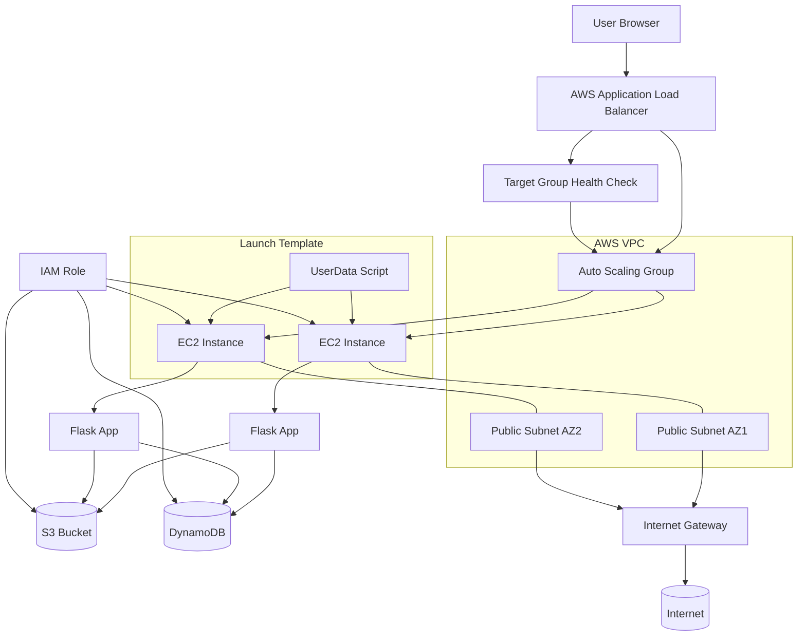

# Employee Directory – Multi-Cloud Migration Project

This repository demonstrates a **real-world cloud migration project**, where a legacy 3-tier web application is deployed on AWS and then re-platformed to Google Cloud Platform using modern Infrastructure as Code and cloud-native services.

The project is designed both as:
- A **completed technical migration case study**
- A **reusable blueprint** for client cloud-migration projects

It showcases multi-cloud architecture, Terraform automation, scalable infrastructure, and application modernization.

---

## Project Goal

Migrate a production-style web application from AWS to GCP while:

- Preserving application functionality
- Replacing cloud-specific services with GCP equivalents
- Improving security and scalability
- Automating everything with Terraform
- Documenting the migration process end-to-end

---

## Repository Structure

```
/
├── AWS/                      # Original AWS deployment (EC2 + ALB + DynamoDB + S3)
│   ├── app/                  # Application source code
│   ├── assets/               # AWS diagrams  
│   ├── terraform/            # AWS Infrastructure as Code
│   └── aws_readme.md/        # AWS deployment guide
│
├── GCP-Compute-Engine/       # GCP migration using Compute Engine + MIG + Security Perimeter Redesign
│   ├── app/                  # Refactored Flask application
│   ├── terraform/            # GCP Infrastructure as Code
│   ├── assets/               # GCP diagrams 
│   ├── MIGRATION.md          # Migration design & architecture
│   └── DEPLOYMENT_GCE.md     # Step-by-step deployment guide
│
├── GCP-Cloud-Run/            # Serverless Cloud Run migration (coming soon)
│
└── README.md                 # This file
```

---

## Architecture Comparison

### AWS – Original Deployment



---

### GCP – Compute Engine Migration

```mermaid
flowchart TB
    U[User Browser] --> LB[Cloud HTTP(S) Load Balancer]

    LB --> MIG[Managed Instance Group]

    MIG --> VM1[Compute Engine VM]
    MIG --> VM2[Compute Engine VM]

    subgraph IT["Instance Template"]
        VM1
        VM2
        SS[Startup Script]
    end

    SS --> VM1
    SS --> VM2

    VM1 --> APP1[Flask App]
    VM2 --> APP2[Flask App]

    APP1 --> GCS[(Cloud Storage Bucket)]
    APP2 --> GCS

    APP1 --> FS[(Firestore Datastore Mode)]
    APP2 --> FS

    subgraph VPC["Custom VPC"]
        SUBNET[Regional Private Subnet]
        MIG
    end

    VM1 --- SUBNET
    VM2 --- SUBNET

    SUBNET --> NAT[Cloud NAT] --> Internet[(Internet)]

    SA[Service Account]
    SA --> VM1
    SA --> VM2
    SA --> GCS
    SA --> FS

    LB --> HC[Health Checks]
    HC --> MIG
```

---

## Why This Project Matters

This repository demonstrates:

- **Terraform Infrastructure as Code**
- **Cloud networking & security design**
- **Scalable compute architectures**
- **Application refactoring for cloud services**
- **Real migration problem-solving**

It represents the same type of migration work commonly performed for real client production systems.

---

## Author

**Dmitry Zhuravlev**  
Cloud DevOps Engineer

---

## License

MIT License — free to reuse with attribution.

