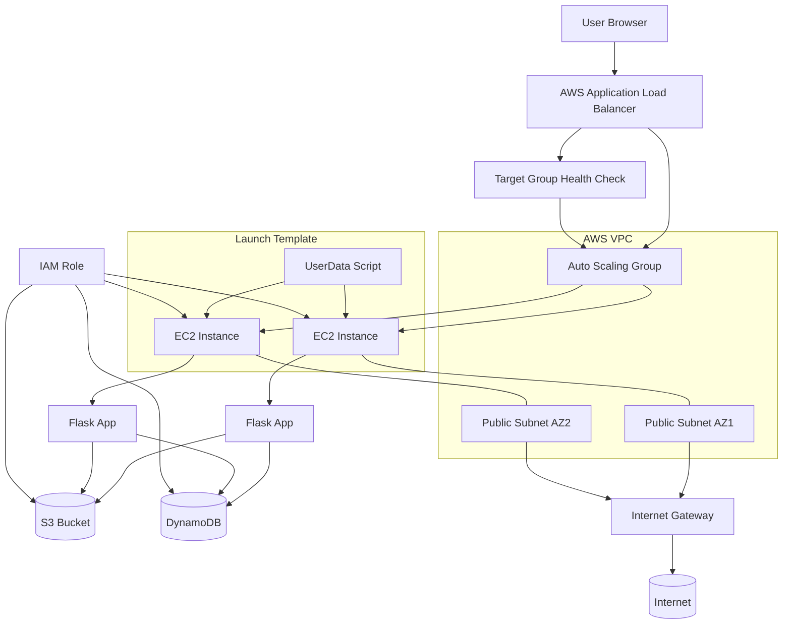
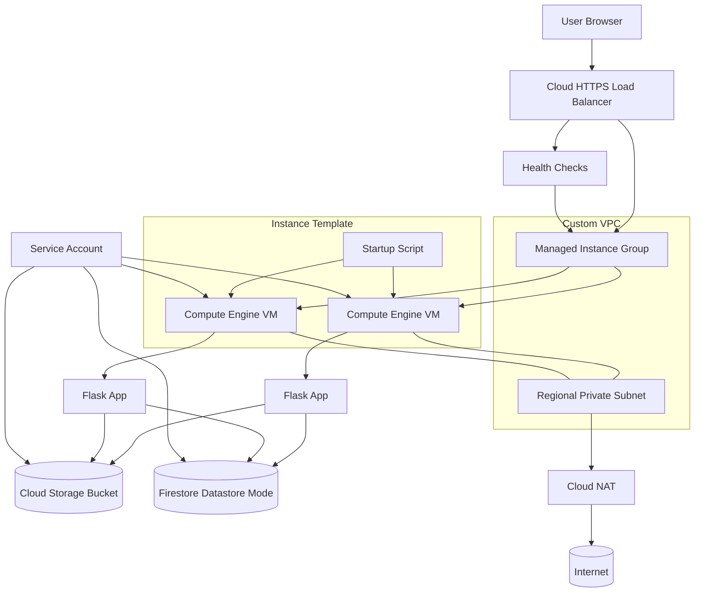

# Architecture

This document describes the **end-to-end architecture** of the Enterprise App across three deployment options:

1. **AWS baseline** – legacy-style EC2 deployment
2. **GCP Compute Engine (Option 1)** – re‑platformed VM-based architecture
3. **GCP Cloud Run (Option 2)** – serverless container architecture with CI/CD

It also captures the design principles that guided the migration and possible future enhancements.

---

## 1. AWS Baseline Deployment (EC2 + ALB + DynamoDB + S3)

The starting point is a classic 3‑tier web application hosted entirely on AWS.

### 1.1 High-Level Description

- **Web tier**
  - Flask application running on EC2 instances
  - Instances managed by an **Auto Scaling Group (ASG)**
  - Public subnets in multiple Availability Zones

- **Traffic entry**
  - **Application Load Balancer (ALB)** terminates HTTP(S)
  - Distributes traffic across instances in the ASG

- **Data and storage**
  - **DynamoDB** for employee records
  - **S3 bucket** for employee photos

- **Identity & access**
  - **IAM roles** attached directly to EC2 instances
  - Permissions for DynamoDB and S3 access

### 1.2 Architecture Diagram (AWS Baseline)



---

## 2. GCP Compute Engine Deployment (Option 1)

The first migration step re‑platforms the AWS baseline to **GCP Compute Engine** with a stronger security perimeter and GCP-native services.

### 2.1 High-Level Description

- **Web tier**
  - Flask application running on Compute Engine VMs
  - VMs managed by a **Managed Instance Group (MIG)**

- **Traffic entry**
  - Global **Cloud HTTPS Load Balancer**
  - Health checks target instances in the MIG

- **Data and storage**
  - **Firestore (Datastore mode)** for employee records
  - **Cloud Storage** bucket for employee photos

- **Networking**
  - Custom **VPC** with regional **private subnet**
  - No public IPs on instances
  - **Cloud NAT** for controlled outbound internet access

- **Identity & access**
  - Dedicated **service account** for the application
  - Granular IAM roles for Firestore and Cloud Storage

### 2.2 Architecture Diagram (GCP Compute Engine)



---

## 3. GCP Cloud Run Deployment (Option 2)

The second modernization step moves the application to a **fully serverless** model using Cloud Run and containerized workloads.

### 3.1 High-Level Description

- **Web tier**
  - Flask app container built from `GCP/app/`
  - Deployed as a Cloud Run service `enterprise-app`
  - Automatic horizontal scaling based on request load

- **Data and storage**
  - Same **Firestore (Datastore mode)** and **Cloud Storage** backend as Option 1
  - Optional **Secret Manager** for configuration

- **Identity & access**
  - Dedicated **runtime service account**
  - Least-privilege IAM for Firestore, Storage, and secrets

- **CI/CD and images**
  - Source in GitHub
  - GitHub Actions workflow builds the container image
  - Image stored in **Artifact Registry**
  - Cloud Run deployments use the latest tagged image

### 3.2 Architecture Diagram (GCP Cloud Run)

```mermaid
flowchart TB
    %% User entrypoint
    U[User Browser] --> HTTPS[Cloud Run HTTPS URL]

    %% Cloud Run service
    subgraph CR["Cloud Run Service: enterprise-app"]
        REV[Container Revision]
    end

    HTTPS --> REV

    %% Runtime data plane
    REV --> FS[(Firestore (Datastore Mode))]
    REV --> GCS[(Cloud Storage Bucket)]
    REV --> SM[(Secret Manager)]

    %% Runtime identity
    SA[Runtime Service Account]
    SA --> REV
    SA --> FS
    SA --> GCS
    SA --> SM

    %% CI/CD and image delivery
    subgraph CI["CI/CD: GitHub Actions + Cloud Build"]
        GH[GitHub Repository]
        WF[cloud-run-deploy.yml Workflow]
        CB[Cloud Build]
        AR[(Artifact Registry)]
    end

    GH --> WF --> CB --> AR
    AR --> REV
```

---

## 4. Design Principles

The architectures above are guided by a consistent set of principles:

1. **Infrastructure as Code (IaC)**
   - Everything is provisioned with Terraform (AWS, GCE, and Cloud Run stacks).
   - Enables repeatable environments and clear change history.

2. **Security by Design**
   - AWS baseline intentionally uses a more permissive, legacy pattern.
   - GCP options move to **private networking**, **Cloud NAT**, and **least-privilege IAM**.
   - Service accounts replace instance-attached broad IAM roles.

3. **Portability of Application Logic**
   - Core Flask application logic is kept largely unchanged.
   - Only configuration and data access layers are adapted between AWS and GCP.

4. **Separation of Concerns**
   - Application deployment concerns (CI/CD pipelines) are separated from base infrastructure provisioning.
   - Terraform focuses on infra; GitHub Actions focuses on build and rollout.

5. **Observability & Operability**
   - Logging and health checks are enabled in each platform.
   - MIG health checks and Cloud Run revisions make failures visible and recoverable.

---

## 5. Future Enhancements

Possible next steps for extending this architecture include:

1. **Multi-region or multi-zone failover**
   - Replicate GCP deployments across regions for higher availability.

2. **Blue/Green or Canary Deployments**
   - Use Cloud Run traffic splitting and/or Load Balancer traffic policies for safer rollouts.

3. **Policy as Code**
   - Introduce tools such as OPA / Terraform Cloud policies for governance.

4. **Enhanced Observability**
   - Add dashboards and alerts in Cloud Monitoring and Cloud Logging.

5. **Deeper Cost Optimization**
   - Leverage committed use discounts, autoscaling tuning, and storage lifecycle rules.

For concrete deployment steps and environment setup, see `docs/deployment.md` and the platform-specific `deployment_*.md` guides.

